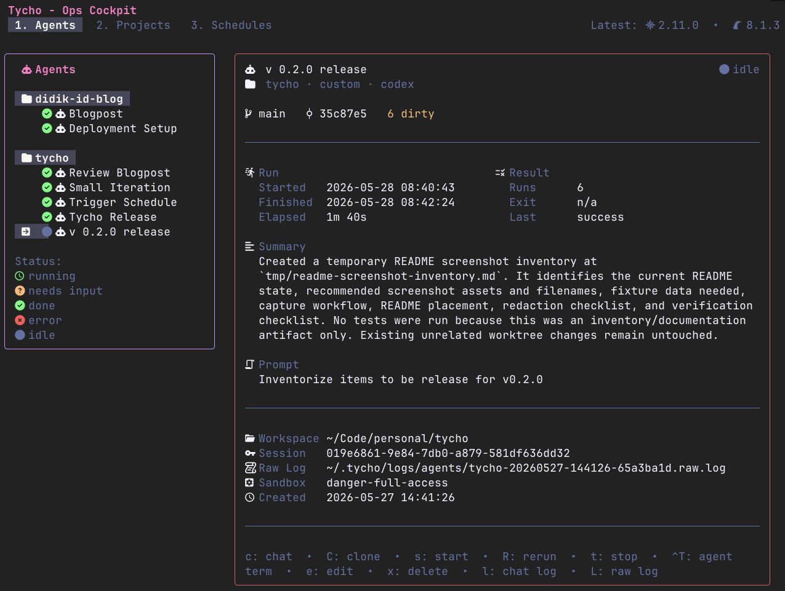
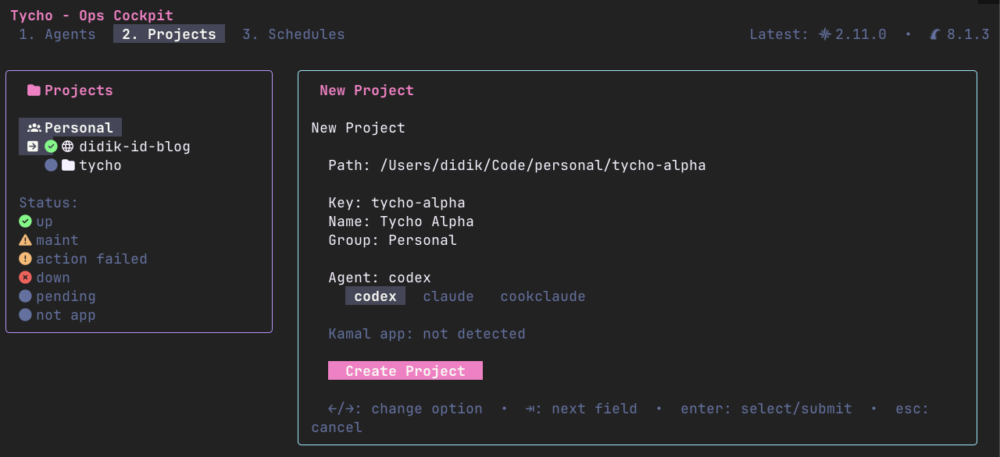
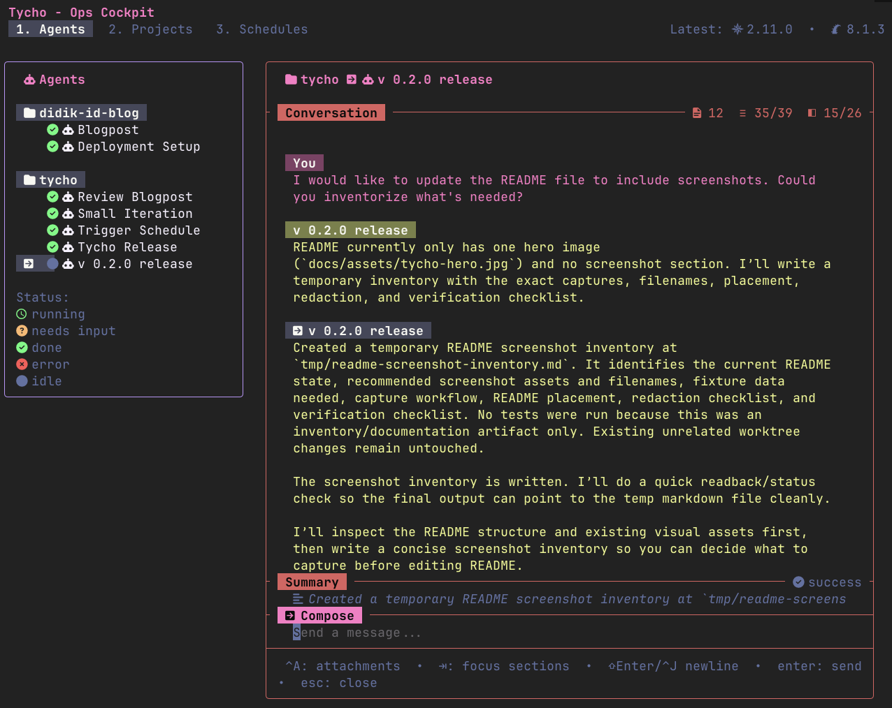
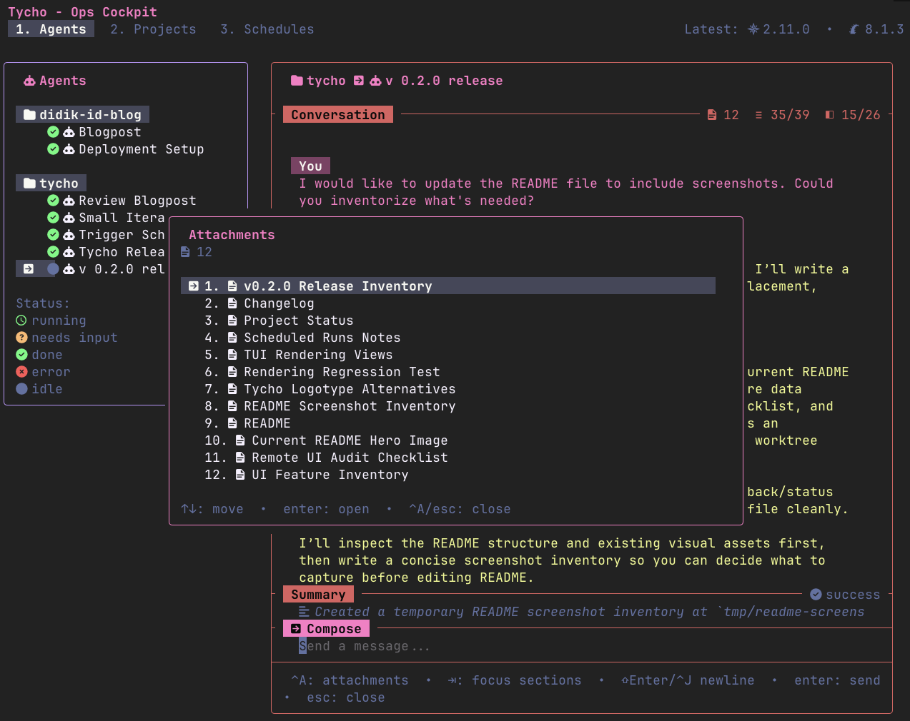
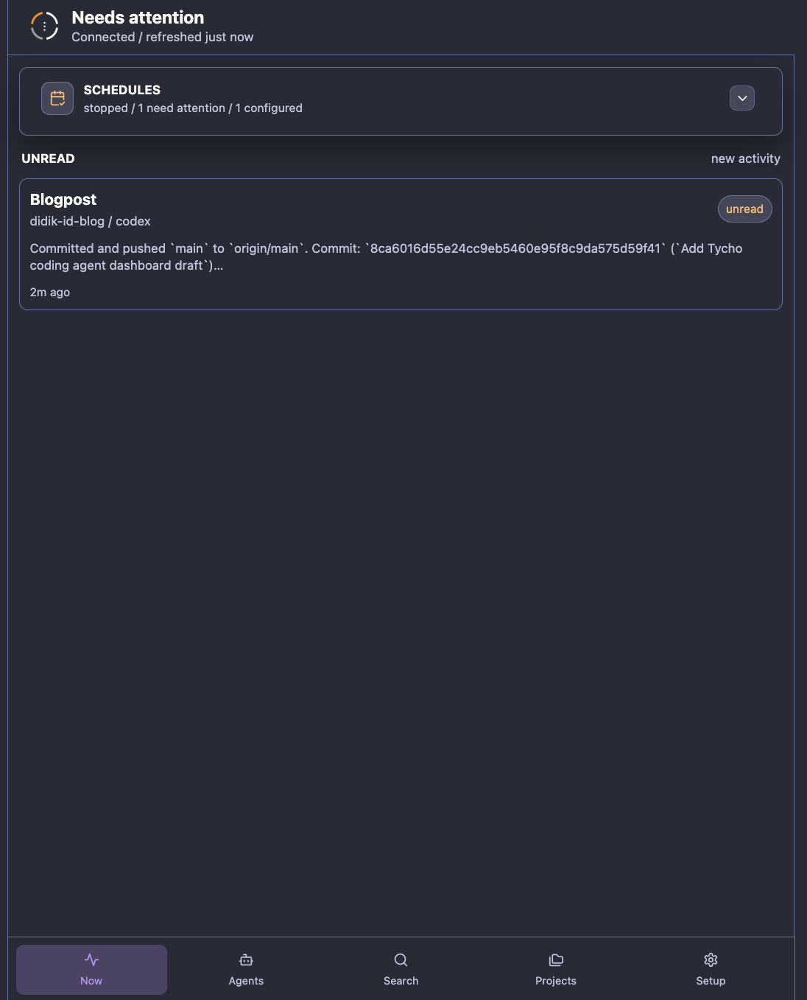
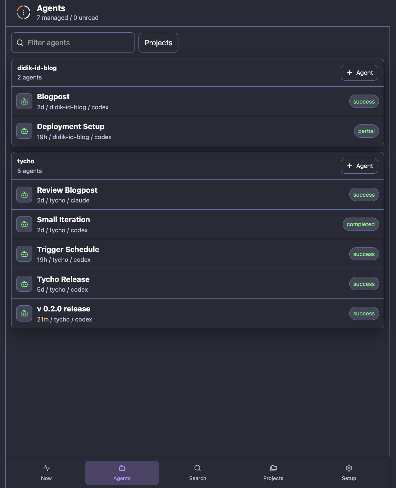
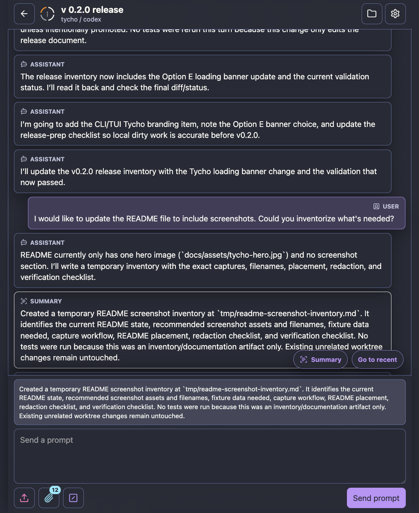
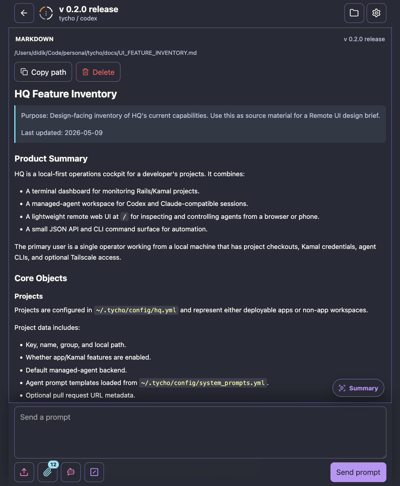
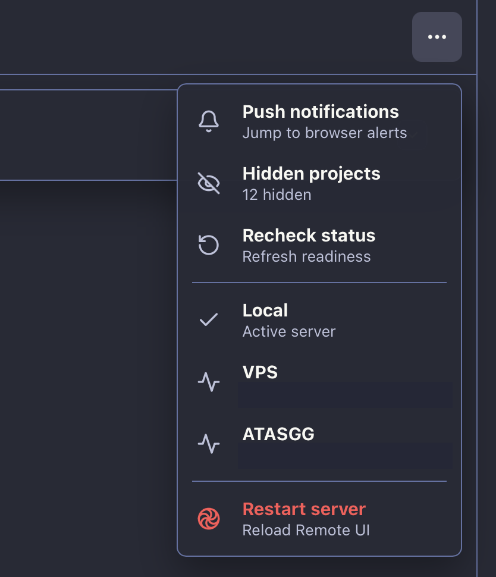
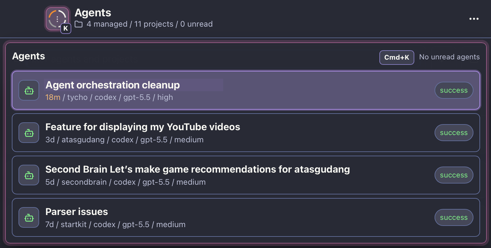

# Tycho

Tycho - Factorio for Agents.

Tycho is a local-first control center for supervising managed coding agents
across many projects. It keeps project context, agent sessions, schedules,
logs, attachments, and follow-up questions in one operator workflow, with both
a terminal UI and an optional lightweight Remote UI for checking agent state
from a browser on your local network or tailnet.

## Screenshots

<p align="center">
  
</p>

### TUI

| Agents dashboard | New project |
|------------------|-------------|
|  |  |

| Chat composer | Attachment picker |
|---------------|-------------------|
|  |  |

### Remote UI

| Needs attention | Agents |
|-----------------|--------|
|  |  |

| Chat composer | Attachment preview |
|---------------|--------------------|
|  |  |

| Remote connection switcher | Agent switcher |
|----------------------------|----------------|
|  |  |

## Status

Tycho is early open-source software. It is designed around a single-operator
workflow and is currently macOS-first for packaged installs. Source installs
also work on Linux-style environments where Ruby and the optional agent CLIs
are available, and Tycho has been tested on Windows 11 through WSL.

## Features

- Project registry from `~/.tycho/config/hq.yml`.
- Managed Codex, Claude, OpenCode, and custom Claude-compatible agents with
  persistent chat memory.
- Scheduled managed-agent runs from cron-style local config.
- In-app log views, agent detail views, project detail views, and omnisearch.
- Local JSON API and mobile Remote UI through `tycho serve`.
- Combined Remote UI agents and projects across multiple Tycho servers through
  a local broker.
- Optional Tailscale MagicDNS URL and terminal QR code for Remote UI access.
- Optional browser push notifications for agent completions and inquiries.
- Agent-scoped pull request diff inspection with GitHub App login and `gh`
  compatibility.

## Requirements

- Homebrew for the packaged macOS install.
- Ruby 3.2 or newer for source installs.
- Bundler for source installs.
- Go, when Charm Ruby native gems need to be compiled during install.
- Windows 11 users should run Tycho inside WSL.

Tycho can run without every optional tool, but features backed by missing tools
will show as unavailable.

See [docs/SETUP_REQUIREMENTS.md](docs/SETUP_REQUIREMENTS.md) for the
dependency checklist and hard/soft failure policy used by `bin/setup`.

## Installation

### Homebrew

Homebrew is the primary install path for users:

```bash
brew tap firewalker06/tycho
brew install tycho
tycho
```

The formula installs one executable, `tycho`. Remote Sessions and scheduled
agents run through subcommands:

```bash
tycho serve
tycho schedule daemon
```

Optional integrations are intentionally not installed by the formula. Install
Claude-compatible harnesses only for the features you use.

### Source Checkout

Use a source checkout when contributing or when Homebrew is not suitable.

One-line setup:

```bash
curl -fsSL https://raw.githubusercontent.com/firewalker06/tycho/main/setup.sh | bash
cd tycho
bin/tycho
```

Pass setup options after `bash -s --`:

```bash
curl -fsSL https://raw.githubusercontent.com/firewalker06/tycho/main/setup.sh | bash -s -- --profile codex
```

Set `TYCHO_DIR` to clone into a different directory, or `TYCHO_REPO_URL` to use
another Git remote.

Manual source setup:

```bash
git clone https://github.com/firewalker06/tycho.git tycho
cd tycho
bin/setup
bin/tycho
```

`bin/setup` installs gems, creates missing user config files from examples
under `~/.tycho`, and prints hard failures plus soft feature warnings for
optional tools. Use `bin/setup --check` to inspect readiness without changing
files, or pass feature profiles such as `bin/setup --profile codex` or
`bin/setup --profile claude` to make those optional tools mandatory.

Run through Bundler if your shell has conflicting gem versions:

```bash
bundle exec bin/tycho
```

Command mapping for source users:

| Homebrew command | Source checkout command |
|------------------|-------------------------|
| `tycho` | `bin/tycho` |
| `tycho serve` | `bin/tycho serve` |
| `tycho schedule daemon` | `bin/tycho schedule daemon` |

## Configuration

Project definitions live in `~/.tycho/config/hq.yml` by default.

```yaml
projects:
  - key: my-workspace
    name: My Workspace
    group: Personal
    path: /Users/you/Code/my-workspace
    agent: codex
```

System prompt templates live beside the project registry as
`system_prompts.yml`.

Tycho also appends a cross-harness writing policy from `response_style.md` to
every cold and resumed execution. Set `response_style` on a project or
structured prompt template to replace the global text, or set it to `false` to
disable the policy for that scope. Explicit output formats, schemas, code,
quotations, and user-requested genres take precedence over this default.
The global file can be edited from **Settings → Configuration** in Remote UI;
Tycho saves it atomically to `~/.tycho/config/response_style.md` by default.

Real config files, `.env`, runtime logs, and generated agent artifacts are
gitignored. Keep secrets and machine-specific paths out of committed files.
Runtime state and logs default to `~/.tycho/logs`.

### Where Tycho Writes Files

Homebrew and source installs use the same user-scoped defaults:

| Purpose | Default |
|---------|---------|
| Project registry | `~/.tycho/config/hq.yml` |
| System prompts | `~/.tycho/config/system_prompts.yml` |
| Response style policy | `~/.tycho/config/response_style.md` |
| Schedules | `~/.tycho/config/schedules.yml` |
| Schedule prompt files | `~/.tycho/schedules/` |
| Hooks | `~/.tycho/config/hooks.yml` |
| Remote server peers | `remote_servers` in `~/.tycho/config/hq.yml` |
| Runtime state and logs | `~/.tycho/logs/` |
| Project logs | `~/.tycho/logs/projects/` |
| Agent logs and artifacts | `~/.tycho/logs/agents/` |
| Browser push state | `~/.tycho/logs/push_*.json` and `~/.tycho/logs/web_push_vapid.json` |
| GitHub App session | `~/.tycho/config/github_auth.json` with mode `0600` |

Tycho does not write runtime files under the Homebrew Cellar. Set the
`TYCHO_*` environment variables below to move config or state for tests,
temporary runs, or multi-profile setups.

### Environment Variables

Use the `TYCHO_` prefix for runtime overrides.

| Variable | Purpose |
|----------|---------|
| `TYCHO_HOME` | Override the default `~/.tycho` root. |
| `TYCHO_CONFIG_DIR` | Override the default user config directory. |
| `TYCHO_CONFIG_PATH` | Override the project registry path. |
| `TYCHO_SYSTEM_PROMPTS_PATH` | Override the system prompt template path. |
| `TYCHO_RESPONSE_STYLE_PATH` | Override the global response style policy path. |
| `TYCHO_SCHEDULES_PATH` | Override scheduled-agent config path. |
| `TYCHO_SCHEDULES_ROOT` | Override schedule message file root. |
| `TYCHO_HOOKS_PATH` | Override global hooks config path. |
| `TYCHO_LOGS_ROOT` | Override runtime state and logs root. |
| `TYCHO_SKILLS_HOME` | Override the home prefix used for harness skill installation, primarily for isolated tests or profiles. |
| `TYCHO_SCHEDULES_STATE_PATH` | Override scheduler runtime state path. |
| `TYCHO_SCHEDULER_DAEMON_PATH` | Override scheduler daemon heartbeat path. |
| `TYCHO_CODEX_BIN` | Override Codex executable lookup. |
| `TYCHO_CLAUDE_BIN` | Override Claude executable lookup. |
| `TYCHO_STRUCTURED_OUTPUT_CORRECTION_LIMIT` | Set schema-correction attempts for Codex and Claude-compatible managed agents. Defaults to `2`; Tycho clamps values to `0..5`. |
| `TYCHO_TAILSCALE_BIN` | Override Tailscale executable lookup. |
| `TYCHO_GH_BIN` | Override the compatibility GitHub CLI lookup. |
| `TYCHO_GITHUB_APP_CLIENT_ID` | Public Client ID for the Tycho GitHub App device flow. |
| `TYCHO_GITHUB_APP_SLUG` | App slug used to build the organization installation URL. |
| `TYCHO_GITHUB_APP_INSTALL_URL` | Override the GitHub App installation URL. |
| `TYCHO_GITHUB_AUTH_PATH` | Override the local App session file path. |
| `TYCHO_GITHUB_WRITE_ENABLED` | Allow separately confirmed review posting when the App has write permission. |
| `TYCHO_REMOTE_TOKEN` | Require bearer auth for non-local Remote UI/API access. |
| `TYCHO_LOG_LEVEL` | Set Tycho's log level, such as `DEBUG` or `INFO`. |

Web Push can also use `TYCHO_WEB_PUSH_VAPID_PUBLIC_KEY`,
`TYCHO_WEB_PUSH_VAPID_PRIVATE_KEY`, and `TYCHO_WEB_PUSH_VAPID_SUBJECT`.

### GitHub App

Register a GitHub App for Tycho and enable **Device Flow**. A callback URL,
client secret, webhook, and private key are not required for user-to-server
device authentication. Configure these repository permissions:

- **Contents: read**
- **Issues: read**
- **Pull requests: read**
- **Checks: read**
- **Commit statuses: read**

Use **Pull requests: write** only if review posting is required. Set the App's
public Client ID and slug in `.env`, restart Tycho, then connect from
**Settings → GitHub** or **Reviews**:

```dotenv
TYCHO_GITHUB_APP_CLIENT_ID=Iv1.example
TYCHO_GITHUB_APP_SLUG=tycho-example
```

Authorizing the user and installing the App are separate. Install the App on
each personal account or organization whose repositories Tycho should review,
then select the smallest useful repository set. Tycho stores refreshable App
credentials locally and never sends them to the Remote UI. When no App session
exists, an authenticated `gh` session remains available for backward
compatibility.

## Commands

Homebrew users run `tycho`. Source checkout users can replace `tycho` with
`bin/tycho` in the examples below.

Open the TUI:

```bash
tycho
```

Start the Remote Sessions server:

```bash
tycho serve
```

Connect and inspect the Tycho GitHub App session:

```bash
tycho github login
tycho github status
tycho github logout
```

Bind explicitly to localhost:

```bash
tycho serve --host 127.0.0.1 --port 7373
```

Manage projects without opening the TUI:

```bash
# Quick creation uses the current directory and derives the display name.
tycho project my-workspace

# The explicit form accepts the same options.
tycho project create my-workspace \
  --path ~/Code/my-workspace \
  --name "My Workspace" \
  --group Personal \
  --harness codex \
  --model gpt-5.5 \
  --reasoning-effort medium

tycho project show my-workspace
tycho project list
tycho project update my-workspace --group Work --model=""
tycho project archive my-workspace
```

Create and update also accept `--response-style`, `--pr-url`, and a
`--hidden=true|false|inherit` visibility override. Add `--json` to any project
command for script-friendly output. Archive rejects projects with running
agents; otherwise it moves the project configuration and logs to their normal
archive locations and archives all managed agents owned by the project.

Connect one Remote UI to multiple Tycho servers by adding `remote_servers` to
`~/.tycho/config/hq.yml`:

```yaml
remote_servers:
  - key: vps
    name: VPS
    icon: server
    url: http://vps-cd946cb7.tail952bf7.ts.net:7373
    token_env: TYCHO_VPS_REMOTE_TOKEN
```

Target a configured peer directly from the CLI with `--server`. Project reads
and the full managed-agent lifecycle use the peer's Remote JSON API; commands
without `--server` keep using local state.

```bash
tycho project list --server vps
tycho project show my-workspace --server vps --json

tycho agent list my-workspace --server vps
tycho agent status <agent-key> --server vps --json
tycho agent create my-workspace "Inspect the failing build" --server vps
tycho agent run <agent-key> --server vps
tycho agent send <agent-key> "Try the smaller reproduction" --server vps
tycho agent stop <agent-key> --server vps
tycho agent archive <agent-key> --server vps
```

Remote CLI commands resolve the server only from `remote_servers` in
`hq.yml`. Each server key owns its credential. Tycho-managed tokens live in
`~/.tycho/config/remote_credentials.json`, which Tycho writes atomically with
`0600` permissions. An explicit `token_env` on that server entry takes
precedence; if the variable is missing, the request fails instead of silently
using another source.

```bash
tycho server login vps                 # hidden prompt; verify before saving
tycho server login vps --no-verify     # save for an offline server
tycho server status [vps] [--json]     # metadata only; never the token
tycho server verify vps
tycho server logout vps
tycho server migrate vps               # move an inline hq.yml token
tycho server migrate --all
```

Credentials bind to the stable server key and, after verification, to the
server's scheme, normalized host, and effective port. Changing that origin
requires login or verification. Authentication rejection marks a credential
rejected and stops automatic reuse until explicit recovery. Inline `token`
entries remain a warned migration fallback through v0.10.x and will be removed
in v0.11.0. `--json` is supported by project list/show and every agent command
above. Errors distinguish unknown server keys, missing external sources,
origin changes, unreachable servers, timeouts, rejected credentials,
unsupported endpoints, and other Remote API responses without printing tokens.

The Remote UI always includes the local server and combines agents and projects
from every configured peer into the same Agents list. Use the server filter to
narrow the list. Local resources use a home icon; peer resources use their
configured `server` or `computer` icon and name. Each agent, project, or
attachment request goes only to its owner. Settings manages peer connections
and identity; schedules, setup, GitHub, push notifications, restart, and other
server-level controls remain local to the server serving the UI.

Run scheduled agents:

```bash
tycho schedule list
tycho schedule daemon --once --dry-run
tycho schedule daemon
```

Manage schedules without opening the TUI:

```bash
tycho schedule validate
tycho schedule list
tycho schedule run <schedule-key>
tycho schedule pause <schedule-key>
tycho schedule resume <schedule-key>
tycho schedule reload
```

Run a non-interactive runtime smoke check:

```bash
tycho doctor
```

The TUI includes a Schedules screen, and the Remote UI `Now` view shows
scheduler daemon freshness plus schedule state. Schedule rows use three
operator-facing statuses: `scheduled`, `paused`, and `stopped`. Last outcome
details such as failed runs or interactive protection are shown separately. The
Remote UI keeps the schedule card compact by showing daemon status, PID, and
last tick in the header, while schedule rows show project, next run, and a
humanized cron cadence such as `every 15 minutes`.

## Scheduled Agents

Schedules create fresh managed agents for projects. They do not run shell
commands directly and do not resume old agent sessions. This keeps recurring
work reviewable and prevents stale context from accumulating across runs.

Definitions live in `~/.tycho/config/schedules.yml`, which is local and gitignored.
Long prompts should live as Markdown files under `~/.tycho/schedules/`.

```yaml
schedules:
  - key: pull-request-review
    name: Pull request review
    enabled: true
    cron: "*/15 * * * *"
    timezone: local
    target:
      type: agent
      project_key: my-workspace
      name: Pull request review
      message_source: file
      message_file: schedules/pull-request-review.md
    policy:
      overlap: skip
      missed: run_once_on_start
      archive_previous_agent: true
```

Use `message_source: inline` with `message: "..."` for short prompts. Use
`message_source: file` and `message_file: schedules/<name>.md` for anything
longer than a few lines. Tycho validates cron syntax, project references, and
that prompt files stay inside `~/.tycho/schedules/`.

Each run automatically appends Tycho's final-output attachment checklist to the
scheduled prompt, so reports, Markdown files, PRs, reviews, images, and other
durable artifacts should be returned in `attachments`.
`no_action_needed` is reserved for successful observational checks where no new
condition required action; completed changes, answers, commits, reviews, and
deliverables use `success` even when no next step remains.

Prompt tips for reliable schedules:

- Make the task idempotent. Tell the agent to check current state first and
  skip work that is already done.
- Give the agent stable dedupe keys, such as PR URL, issue number, date bucket,
  or output path.
- Prefer deterministic output locations like `tmp/<schedule-key>/...`, and say
  whether files should be overwritten, updated in place, or left untouched.
- Require explicit skip conditions. For example: skip a PR that was already
  reviewed after its latest commit, or skip a report that already exists for
  the current date.
- Separate review from mutation. For risky workflows, ask the agent to write a
  review file or plan first and wait for human approval before posting,
  deleting, merging, or sending messages.
- Keep prompts narrow. A scheduled agent should have one recurring job, one
  project, and a clear completion condition.
- Include a no-op result. Tell the agent what to output when there is no work,
  such as `No new PRs to review.`
- Mention artifact expectations. If the run creates or references durable
  output, name the expected files or links so they appear in `attachments`.

If you converse with a scheduled agent, Tycho protects that session. A later
due run stops the schedule with reason `interactive` instead of archiving the
user-touched agent. Resume the stopped schedule when you want Tycho to archive
the active scheduled session and wait for the next scheduled run with fresh
context.

`tycho schedule daemon` writes daemon heartbeat state to `~/.tycho/logs/scheduler_daemon.json`.
The schedule UI treats a missing or stale heartbeat as daemon attention. If it
finds a running scheduler process without heartbeat state, it reports the
daemon as `untracked`; restart `tycho schedule daemon` to restore tick freshness.

## TUI Tutorial

Start the TUI:

```bash
tycho
```

### Create A Project

1. Press `2` to switch to the Projects screen.
2. Press `N` to open the New Project form.
3. Enter the local project path first. Tycho will offer path suggestions and can
   prefill the project key/name as you tab through the form.
4. Fill in the project key, name, and group.
5. Use left/right arrows on the Agent field to choose the default harness
   (`codex`, `claude`, or a configured custom harness).
6. Tab to `Create Project` and press Enter.

Tycho writes the project entry to `~/.tycho/config/hq.yml`, selects the new
project, and starts a metadata refresh.

### Create A Project Agent

1. Stay on the Projects screen and select the project with `j`/`k`.
2. Press `n` to open the Create Agent form for that project.
3. Use left/right arrows to choose the prompt template and harness.
4. Fill in the agent name and prompt. Use Shift+Enter, Alt+Enter, or `ctrl+j`
   for new lines inside the prompt.
5. Choose `Create Agent` to save the agent without starting it, or choose
   `Create and Run Agent` to start it immediately.

After creation, Tycho switches to the Agents screen, selects the new agent, and
opens its chat panel.

### Converse With An Agent

1. Press `1` to switch to the Agents screen.
2. Select an agent with `j`/`k`.
3. Press `c` or Enter to open the agent chat panel.
4. Type your message. Use Shift+Enter, Alt+Enter, or `ctrl+j` for multiline
   prompts.
5. Press Enter or `ctrl+s` to send. If the agent is idle, Tycho starts it
   automatically.

While in chat, use Tab/Shift+Tab to move between the prompt, conversation, and
summary areas. `L` opens the selected agent's raw log from the Agents screen,
and `ctrl+t` opens an interactive terminal session for the selected agent.

## Remote UI Security

`tycho serve` is local-first. If `TYCHO_REMOTE_TOKEN` is unset, API requests are
accepted without authentication. This is intended only for localhost.

Set a token before binding to Tailscale or any non-loopback address:

```bash
TYCHO_REMOTE_TOKEN="$(ruby -rsecurerandom -e 'puts SecureRandom.hex(24)')" tycho serve
```

When Tailscale HTTPS Serve is available, Tycho can print an HTTPS MagicDNS
Remote UI URL and QR code. Public screenshots should redact MagicDNS URLs,
Tailscale IPs, and QR codes.

For multiple Remote servers, the browser still talks only to the Tycho server
that served the UI. That local server returns a cached combined resource
catalog and brokers each detail or mutation request to the resource's owner,
using each peer's selected external or Tycho-stored credential. Saving a token
in Settings verifies it, writes it to the host's private
`remote_credentials.json`, and only then removes the browser-local copy.

## Custom Claude Harnesses

Tycho has built-in `codex`, `claude`, and `opencode` harnesses. To run Claude
through a wrapper, define a custom harness in `~/.tycho/config/hq.yml` and use
its key as a project or template agent:

```yaml
custom_harnesses:
  - key: claude-wrapper
    adapter: claude
    execution_command: /Users/you/bin/claude-wrapper

projects:
  - key: my-workspace
    name: My Workspace
    group: Personal
    path: /Users/you/Code/my-workspace
    agent: claude-wrapper
```

`execution_command` may be a shell string or an argv list. The command must be
Claude-compatible because Tycho appends Claude CLI flags for stream-json output,
structured result schemas, and native session resume.

## Structured Output Correction

Tycho validates each final managed-agent response against
`~/.tycho/config/schemas/agent_result.json` before accepting it as successful.
When JSON is malformed or violates the schema, Tycho sends concise JSON feedback
to the same native Codex or Claude-compatible session and asks for one complete
corrected payload. The feedback reports only error codes, schema paths, expected
types, and allowed enum values; it does not copy response values.

The default limit is two correction attempts (three total responses). Set
`TYCHO_STRUCTURED_OUTPUT_CORRECTION_LIMIT=0` to disable correction while keeping
validation, or choose up to `5`. If the limit is exhausted, the run fails with
an actionable summary and keeps the final invalid response in the agent's
owner-readable `*.invalid_structured_output.json` diagnostic file. Raw and
system logs record validation events, and the Remote UI shows the failed status
and summary without treating the invalid payload as a successful result.

Each validation failure also appears in the conversation as a collapsed
**system event block** branded **TYCHO**, between the rejected response and the
next response. The compact row shows whether Tycho is retrying or has exhausted
the limit. Expanding it shows schema paths and safe error details, but never
copies rejected field values into the conversation.

Use `TYCHO_CODEX_BIN`, `TYCHO_CLAUDE_BIN`, or another documented environment
override when a harness executable is not on `PATH`.

## Tests

Run the main test suite:

```bash
bin/test
```

Run an individual test:

```bash
bundle exec ruby test/rendering_test.rb
```

## Known Limitations

- Tycho is macOS-first for the initial Homebrew release.
- Linux and Windows 11 through WSL are source-install targets where Ruby,
  native build tools, and optional CLIs are available, but they are not the
  primary packaged target yet.
- Remote UI is local-first. Set `TYCHO_REMOTE_TOKEN` before binding to a
  non-loopback interface.
- Custom harness dependencies remain the operator's responsibility.
- Managed agents can run powerful local tools. Review prompts, project paths,
  and sandbox settings before starting agents.

## Documentation

- `docs/PROJECT_STATUS.md`: current roadmap and architectural decisions.
- `docs/SYSTEM_PROMPT_AUDIT.md`: when Tycho introduces system and automatic prompt context, the exact content, purpose, and known contract gaps.
- `docs/REMOTE_SERVER.md`: Remote Sessions API and Remote UI behavior.
- `docs/TYCHO_SKILLS.md`: Tycho skill source, install/update paths, ownership safety, and verification.
- `docs/SCHEDULED_RUNS.md`: scheduled-agent design, policies, and runtime state.
- `docs/GOTCHAS.md`: operational pitfalls.
- `docs/OPEN_SOURCE_PLAN.md`: open-source readiness plan and launch criteria.

## Contributing

See `CONTRIBUTING.md` and `CODE_OF_CONDUCT.md`.

## Security

See `SECURITY.md`.

## License

Tycho is released under the MIT License. See `LICENSE`.
