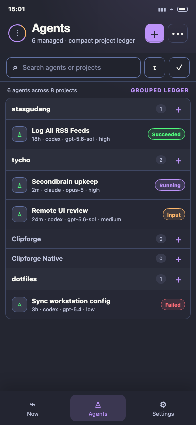
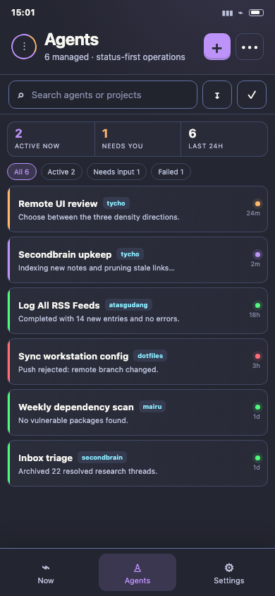
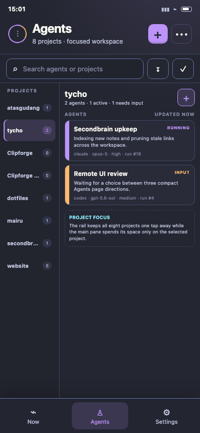
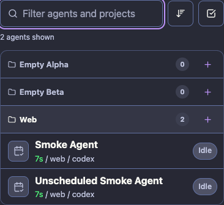

# Agents page redesign concepts

Three mobile-first directions for reducing empty space on Tycho's Agents page:

1. **Compact grouped ledger** — preserves project grouping, compresses empty projects to one line, and keeps agents as dense rows. This is the lowest-risk production direction because it changes density without changing navigation.

   

2. **Status-first pulse board** — removes empty projects from the main feed and prioritizes active, blocked, failed, and recent work. This is the fastest option for operational scanning, but projects become secondary metadata.

   

3. **Project rail + focused workspace** — shows every project in a narrow rail while dedicating the main pane to one project's agents. This scales best when project count grows, but adds a project-selection step.

   

Open `prototype.html?variant=ledger`, `prototype.html?variant=pulse`, or `prototype.html?variant=rail` to inspect the static concepts. The prototype stays isolated from application code; the selected ledger direction is implemented below.

## Implemented direction

The compact grouped ledger now runs in the production Remote UI. This Chrome capture uses the smoke-test fixture and includes two populated agents plus two empty projects.

