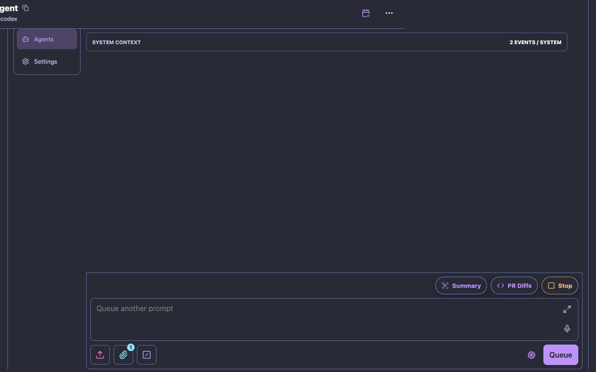
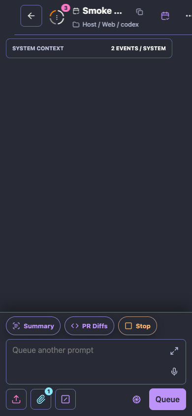
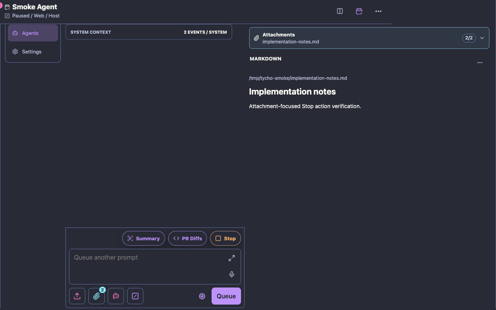

# Remote UI Stop action

These Chrome captures verify the running-agent Stop action in the shared top
shortcut row instead of the prompt composer. They were generated from the
throwaway `bin/remote-ui-smoke` fixture with
`TYCHO_REMOTE_UI_CAPTURE_DIR` and cover desktop conversation, mobile
conversation, and desktop attachment layouts.

