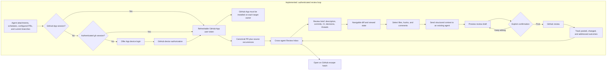

# Pull Request Review Experience

## Outcome

The cross-agent Review Inbox is paused. Its first implementation performs too much eager aggregation and GitHub work, which makes the page slow and unresponsive. The top-level route, navigation entry, and route-driven polling are disabled until the inbox is redesigned around bounded, incremental loading. Agent-scoped PR diff inspection and the underlying direct GitHub API, authentication, review-state, handoff, draft, and posting code remain available for that future work.

Tycho prefers a Tycho GitHub App user session obtained through OAuth device flow and falls back to an existing authenticated `gh` session for backward compatibility.

Review posting remains off by default. Operators must also set `TYCHO_GITHUB_WRITE_ENABLED=true`, save a draft bound to the current base and head, and confirm the mutation. GitHub remains the final permission authority; a token without `Pull requests: write` receives a sanitized failure.

## Workflow



The implementation keeps four deliberate boundaries:

- Discovery accepts canonical GitHub PR URLs from structured or link attachments, configured project PRs, and open PRs for a project’s current branch. It does not scrape conversation prose.
- The inbox fetches bounded metadata and a compact GraphQL summary. It does not fetch every patch.
- Handoffs tell agents not to mutate GitHub. Posting only happens through the separately confirmed review route.
- Each Remote server owns its credential and stores. The browser never receives the token.

## GitHub Integration Boundary

Tycho uses two ordered credential sources:

```text
Tycho GitHub App session exists
  → use its refreshable user access token
  → direct HTTPS requests to GitHub

No App session, but gh auth token succeeds
  → use the GitHub CLI credential as a compatibility provider
  → direct HTTPS requests still run through GitHubAPIClient

Neither credential exists
  → show GitHub App device login when TYCHO_GITHUB_APP_CLIENT_ID is configured
  → PR routes return a stable integration-not-configured error
```

The OAuth device code stays server-side. The browser only receives the one-time user code, verification URL, expiry, and an opaque login ID. App access and refresh tokens are stored in `~/.tycho/config/github_auth.json` with mode `0600`; they are never returned by `/setup`, sent to the browser, written to `hq.yml`, persisted in snapshots, included in errors, or logged. `/setup` exposes provider, account, expiry, App readiness, installation URL, and `gh` compatibility state without credential values.

Direct API access still uses two representations of the same endpoint:

```http
GET /repos/{owner}/{repo}/pulls/{number}
Accept: application/vnd.github+json
Authorization: Bearer ${GITHUB_APP_OR_GH_TOKEN}

GET /repos/{owner}/{repo}/pulls/{number}
Accept: application/vnd.github.diff
Authorization: Bearer ${GITHUB_APP_OR_GH_TOKEN}
```

Both requests include a pinned `X-GitHub-Api-Version` and a Tycho `User-Agent`. The JSON response supplies metadata; the diff response continues through `HQ::GitDiff.parse_patch_text`. Conditional requests, response limits, rate-limit headers, bounded timeouts, and sanitized errors belong in the client rather than in route handlers.

The GitHub App must be installed on every personal account or organization whose repositories Tycho should access. Give the App **Contents: read**, **Pull requests: read**, **Issues: read**, **Checks: read**, and **Commit statuses: read**. Enable **Pull requests: write** only when guarded review posting is intended. Device authorization identifies the user; installation grants repository access. Both are required for private organization repositories.

## Capability Matrix

| Area | State | Evidence and gap |
|---|---|---|
| GitHub App OAuth device login | **Current** | Remote UI and `tycho github login` start and poll device authorization, store refreshable user tokens with mode `0600`, refresh expiring tokens, and support local logout. |
| GitHub App installation boundary | **Current** | Setup and the Review login state expose the configured installation URL and explain that every target owner needs an installation. GitHub remains authoritative for installation and repository selection. |
| `gh` backward compatibility | **Current** | If no App session exists, Tycho obtains the active `gh` credential and continues using the same direct HTTP client. App authentication always takes precedence. |
| Direct GitHub API client | **Current** | `HQ::GitHubAPIClient` uses direct REST and GraphQL requests with pinned version, timeouts, response limits, pagination, ETags, rate metadata, and redaction. |
| GitHub PR discovery from agent attachments | **Current** | Canonical GitHub PR links are accepted and deduplicated globally. `kind: pull_request` is not required. |
| Scheduled-review discovery | **Current** | Scheduled agents retain schedule ownership on occurrences, and scheduled prompts require a canonical PR link when a run reviews or changes one. |
| Current project or branch PR discovery | **Current** | Configured `pr_url` values and open PRs for a project’s current GitHub branch feed the inbox. |
| Cross-agent queue, ownership, filtering, and priority | **Paused** | The implementation remains in place, but the top-level route and navigation are disabled because eager aggregation does not meet responsiveness requirements. |
| Unread and stale state | **Current** | PR read time, code freshness, activity freshness, changed-since-review, invalidation, priority, and outcome live outside immutable snapshots. |
| Basic PR metadata | **Current** | The queue exposes author, state, draft, refs, SHAs, mergeability, checks, review decision, unresolved threads, and freshness. |
| Description, commits, CI, reviews, and threads | **Current** | The review brief includes description, commits, checks, reviews, inline and issue comments, and GraphQL review threads. GitHub remains the full-timeline escape hatch. |
| Patch fetch, parsing, and caching | **Current** | Direct unified diff responses pass through `HQ::GitDiff` into versioned, locked snapshots. |
| Diff readability | **Current** | Unified lines, numbers, counts, rename, binary, generated, omitted, and structurally truncated states are explicit. |
| Diff navigation and reviewed state | **Current** | File search, previous and next file or hunk, keyboard shortcuts, viewed state, and file, hunk, and comment selections are durable. |
| Polling, mobile, and accessibility | **Current** | Route, form, focus, details, and scroll preservation are reused; review controls are labeled, keyboard reachable, and responsive. |
| Agent handoff | **Current** | Operators select context, see snapshot provenance, explicitly send to an existing agent, and retain a handoff audit record. |
| Review drafting, posting, and outcomes | **Current** | Drafts stay local, posting requires an enabled write gate and second confirmation, stale drafts fail, and idempotency keys and outcomes are stored. |
| Open on GitHub | **Current** | Available as the escape hatch for missing context and actions. |

## Prioritized Inventory

### Seamless-review essentials

1. **Establish the GitHub App integration boundary.**
   Prefer a refreshable GitHub App user session, keep `gh` as an explicit compatibility source, expose provider and installation state without credentials, and fail closed when neither source is authenticated.

2. **Make discovery deterministic and model ownership correctly.**
   Require canonical PR link attachments from review runs. Also discover the current branch PR and configured project PR. Model one canonical PR with multiple source occurrences so every agent, schedule, project, first-seen time, last-seen time, and review outcome survives deduplication.

3. **Add a read-only Review Inbox.**
   Aggregate across agents on the active server. Filter by project, repository, author, draft, action-needed, unread, code-stale, CI state, and review state. Sort blocked or changes-requested PRs first, followed by failing CI, unread code changes, and age.

4. **Show a compact review brief.**
   Put the description, author, base and head, draft and mergeability, commit summary, checks, approvals and change requests, unresolved-thread count, and linked issue in Tycho. Keep full timelines, unusual merge controls, and provider-specific details behind **Open PR**.

5. **Build real diff navigation.**
   Add a searchable file list or tree, next and previous file and hunk, stable anchors, selected and viewed state, generated, renamed, binary, and large-file handling, and a code-aware comparison with the last reviewed base and head. Preserve selection, focus, expansion, and scroll during polling and refresh.

6. **Create structured agent handoff.**
   Let the operator select files, hunks, and existing comments; preview the exact context; then send it to an existing agent. Record the source PR, base and head SHA, paths, line ranges, and receiving agent run.

7. **Gate review mutation.**
   Draft locally first. Show the repository, PR, event (`COMMENT`, `APPROVE`, or `REQUEST_CHANGES`), inline comments, and current head SHA in a confirmation step. Revalidate the head and permissions immediately before posting. Polling and agent completion must never post implicitly.

8. **Track review outcomes.**
   Distinguish discovered, unread, inspected, handed off, draft-ready, posted, changed-after-review, and addressed. Treat agent claims as evidence, not authoritative GitHub state.

9. **Harden storage and API execution before scaling.**
   Replace the global unlocked read-modify-write cycle, split activity freshness from code freshness, enforce bounded pagination and concurrency, and expose rate, authentication, and error diagnostics.

### Later enhancements

- Add GitLab or other providers after the GitHub contract stabilizes.
- Add TUI review navigation after proving the Remote UI interaction model.
- Add review templates, ownership rules, saved filters, notifications, and SLA views.
- Add generated-file collapsing, side-by-side diff, blame or context expansion, and commit-by-commit mode.
- Add cross-server federation only with explicit server identity and credential boundaries.

## Residual Technical Risk Register

| Severity | Risk and current evidence | Mitigation |
|---|---|---|
| **Low** | Canonical IDs omit agent ownership by design, while immutable snapshot IDs include repository, PR number, base, and head. | Keep occurrence migration tests when the store schema changes. |
| **Medium** | JSON stores use locked read-modify-write and atomic replacement, but a large long-lived store still rewrites the full document. | Move to SQLite if retention or multiserver write volume makes lock duration material. |
| **Low** | Code freshness uses base and head; activity freshness uses `updated_at`. | Add event cursors if GitHub activity needs more precise unread semantics. |
| **Medium** | Diff truncation only keeps complete files and records omitted counts, but a single file larger than the limit yields no local hunks. | Add paginated file-patch fallback or on-demand per-file fetch; keep Open on GitHub visible. |
| **Medium** | Compatibility mode invokes `gh auth token`; ambient `GH_TOKEN` and the active `gh` account can change which identity Tycho uses. | Show `github.source: gh`, prefer the App session, never log the returned credential, and keep compatibility removable after App adoption. |
| **Critical** | OAuth access and refresh tokens are durable credentials. A copied auth file could expose every installed repository allowed to both the App and user. | Store only in the user config directory with mode `0600`, redact GitHub token formats, never return tokens to the browser, rotate access tokens, and support immediate local logout and GitHub-side revocation. |
| **High** | User authorization alone does not grant organization access; the App must also be installed on that owner and selected repositories. | Show installation state and URL next to login, document the dual requirement, and preserve GitHub's 403/404 errors without claiming authorization succeeded for a repository. |
| **Low** | Base or head changes invalidate viewed state, selections, and drafts and posting revalidates both SHAs. | Add remapping later only when it can prove line identity. |
| **Medium** | Requests are bounded and expose rate metadata, but the queue still makes metadata and GraphQL calls per PR. | Add ETag-backed TTL caching and bounded parallel execution before large organization-wide queues. |
| **Low** | Transport is isolated in `GitHubAPIClient`; provider, context, routes, and parser remain separately testable. | Keep provider contract fixtures current with GitHub API versions. |
| **Medium** | Diff text, titles, metadata, and errors are untrusted. The current viewer escapes text and canonicalizes GitHub links, but future Markdown or new link types could reopen injection paths. | Sanitize API errors and Markdown, allowlist external URLs, cap dimensions, escape all text, and apply a strict content security policy. |
| **Medium** | Remote servers have separate filesystem stores and ambient credentials. A future aggregate queue could mix identical IDs, private metadata, and mutation targets. | Namespace client and global identity by server, show server ownership prominently, and require an explicit target and credential check for cross-server actions. |
| **Medium** | Last good snapshots survive offline errors, and review state is versioned, but retention and migration policy remain basic. | Add age and size caps plus explicit migrations before schema version 2. |
| **Medium** | Unit and route tests cover transport, redaction, structural truncation, concurrency, ownership, invalidation, and gating; browser smoke covers the main desktop and mobile loop. | Add destructive-post contract tests against a dedicated GitHub fixture repository before enabling writes by default. |

## Implemented Foundation

The GitHub App and `gh` compatibility foundation, Review Inbox, review brief, navigation, handoff, and guarded posting are implemented. The Review Inbox surface is paused pending a performance redesign.

### Future: Canonical Tycho GitHub App

The current implementation accepts `TYCHO_GITHUB_APP_CLIENT_ID` and
`TYCHO_GITHUB_APP_SLUG` because the public Tycho App does not exist yet.
Complete these steps in order:

1. Build and publish the Tycho homepage for marketing and for the GitHub App
   homepage requirement.
2. Register the public Tycho GitHub App with Device Flow enabled and the
   documented repository permissions.
3. Copy the App's public client ID and canonical slug into Tycho defaults.
   Keep environment overrides for forks, development, and GitHub Enterprise.

The client ID and slug are public identifiers and may be shipped with Tycho.
Client secrets, device codes, access tokens, and refresh tokens must remain
outside the repository and browser payloads.

### Acceptance criteria

- [x] A Tycho GitHub App user session is the preferred credential source; `gh` is the compatibility source only when no App session exists.
- [x] OAuth device login sends only the public user code, verification URL, expiry, and opaque login ID to the browser; the device code and resulting tokens remain server-side.
- [x] `tycho github login`, `status`, and `logout` provide the same credential lifecycle without requiring the Remote UI.
- [x] Expiring App access tokens refresh without a client secret, and logout removes the local access token, refresh token, pending device code, and backup.
- [x] Disabled mode performs no PR discovery, metadata refresh, patch fetch, or PR polling. Direct PR API requests receive one stable integration-not-configured response while the UI offers App login when configured.
- [x] `/setup` and `bin/tycho doctor` report provider, App readiness, `gh` compatibility, account, and expiry without exposing credential values.
- [x] The implementation makes direct HTTPS requests to GitHub. Compatibility mode invokes only `gh auth token`; it does not use `gh api` or parse CLI PR output.
- [x] Metadata uses GitHub's JSON representation; the patch uses the unified diff media type and continues through `HQ::GitDiff`.
- [x] The HTTP client applies bounded connect/read/write timeouts, a maximum response size, conditional requests, pagination, sanitized errors, and rate-limit metadata.
- [x] `GET /pull-requests` aggregates attachment references across active agents plus current and configured project PRs.
- [x] One canonical PR lists all source agents, schedules, and projects.
- [x] Canonical PR identity and immutable snapshot identity are separate from occurrence and read state.
- [x] Concurrent saves cannot lose records.
- [x] Queue entries expose author, draft and state, base and head, mergeability, checks summary, review decision, unresolved-thread count, and separate code and activity freshness.
- [x] Filters cover project, repository, unread, action-needed, stale code, draft, and CI or review state.
- [x] The selected PR survives polling and metadata refresh.
- [x] Opening the inbox performs bounded metadata work and does not fetch every patch.
- [x] Existing snapshots remain usable offline with an age and error label.
- [x] The result schema and default scheduled-review prompts require a canonical PR link attachment and short outcome.

### Likely modules and tests

- Domain: `github_auth.rb` owns App device OAuth, refresh, secure persistence, and `gh` compatibility; `github_api_client.rb` owns direct HTTP; review providers remain transport-agnostic.
- API: expose boolean GitHub capability through setup; gate existing agent PR routes and add `GET /pull-requests`, source filters, and sanitized provider errors in `lib/hq/remote_server.rb`.
- UI: inbox route, state, and rendering in `lib/hq/remote_ui/assets/app.js`; routing in `app_helpers.js`; responsive styles in `app.css`.
- Contracts and diagnostics: `config/schemas/agent_result.json`, `lib/hq/registry.rb`, scheduled-review defaults, setup payloads, and `bin/tycho doctor`.
- Tests: use fake OAuth and API transports for device polling, token refresh, App precedence, `gh` fallback, authentication headers, JSON and diff media types, ETags, pagination, limits, timeouts, rate limits, and redaction; expand inbox/store and browser coverage.

## P1: Navigable, Durable Review State — Implemented

Add file search and navigation, next and previous file and hunk, viewed state bound to base and head, generated, binary, rename, and large-file states, structural truncation, and a comparison with the last reviewed snapshot.

### Acceptance criteria

- [x] A 1,000-file fixture remains bounded and navigable.
- [x] Binary, generated, and renamed files are explicit.
- [x] Partial hunks never appear complete.
- [x] Base or head changes invalidate reviewed selections.
- [x] Focus, selected file and hunk, expansion, and scroll survive polling and refresh.
- [x] Desktop keyboard and mobile browser tests pass.

### Likely modules and tests

- `lib/hq/domain/git_diff.rb`
- `lib/hq/domain/pull_request_diff.rb`
- A versioned review-state store
- PR routes in `lib/hq/remote_server.rb`
- `lib/hq/remote_ui/assets/app.js` and `app.css`
- Parser fixtures, API tests, and browser smoke tests

## P2: Agent Handoff and Gated Posting — Implemented

Add structured selection payloads, existing-agent targeting, handoff audit records, local review drafts, and explicit posting confirmation. Fetch and show unresolved threads and inline comments through the direct API. Track posted and addressed outcomes from GitHub rather than agent prose.

### Acceptance criteria

- [x] The operator can select files, hunks, and comments, preview immutable snapshot provenance, and trace the receiving agent.
- [x] No handoff occurs without an explicit send action.
- [x] No GitHub write occurs without a second confirmation.
- [x] Posting is unavailable unless the operator enables `TYCHO_GITHUB_WRITE_ENABLED`; GitHub then verifies the active provider's `Pull requests: write` permission on the confirmed request.
- [x] Posting revalidates repository identity and base and head SHAs immediately before the request.
- [x] Stale drafts are blocked.
- [x] Retries with a recorded idempotency key return the recorded outcome and remain observable.

### Likely modules and tests

- New review-selection, draft, and posting domain objects
- Provider review and mutation methods
- Message and review-draft routes in `lib/hq/remote_server.rb`
- Composer and diff integration in `lib/hq/remote_ui/assets/app.js`
- Managed-agent memory metadata
- Provider contract, authorization, idempotency, and browser confirmation tests

## Historical Corrections Captured by This Replacement

This document replaces the stale design history and corrects these claims:

- PR links already become inspectable diff objects; the old document described that work as missing.
- Agent-scoped discovery, snapshots, refresh routes, and the Remote UI workspace already exist.
- Author, status, review result, and previous and next navigation were absent before this implementation and are now implemented. Copy-hunk behavior remains a later enhancement.
- The canonical result schema rejects `kind: pull_request` because attachment objects disallow extra properties.
- Scheduled runs may reuse a long-lived agent session; they do not always create fresh agents.
- Default scheduled-review prompts previously omitted canonical PR attachments; they now require them.
- The superseded implementation used `gh api` for metadata and `gh pr diff` for patches. Runtime PR code now uses direct HTTPS for both; compatibility mode invokes only `gh auth token` as a credential source.
- Provider errors are sanitized, and rate-limit metadata is retained by the client.
