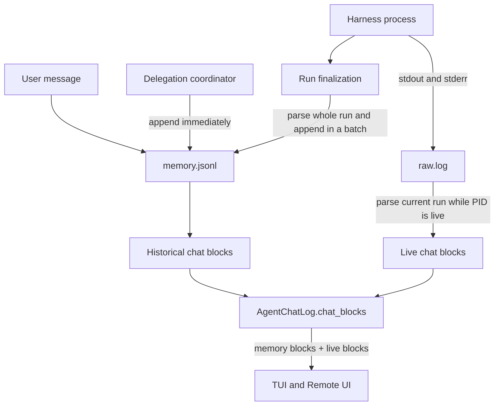
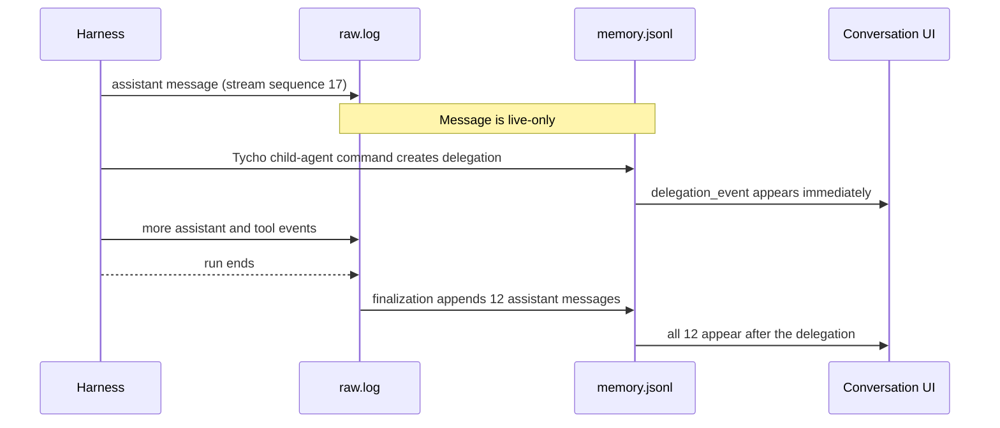
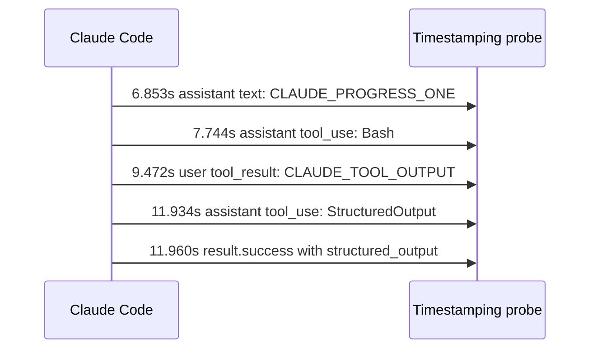
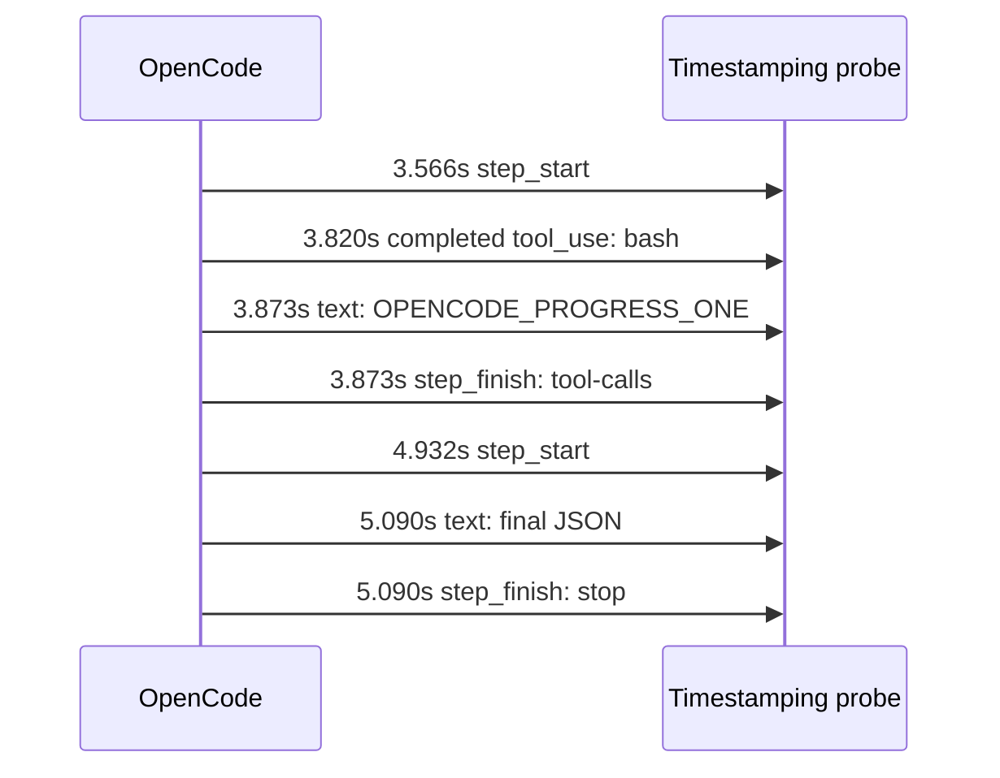
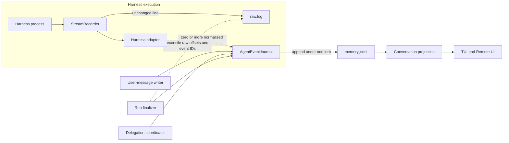
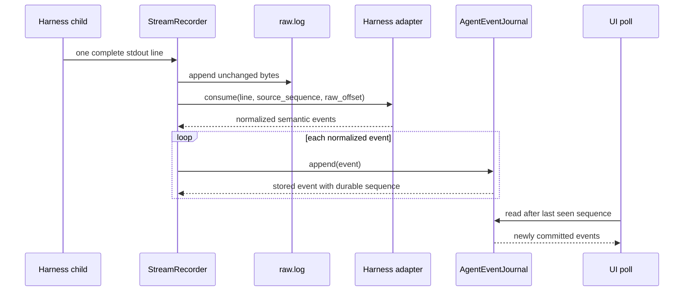
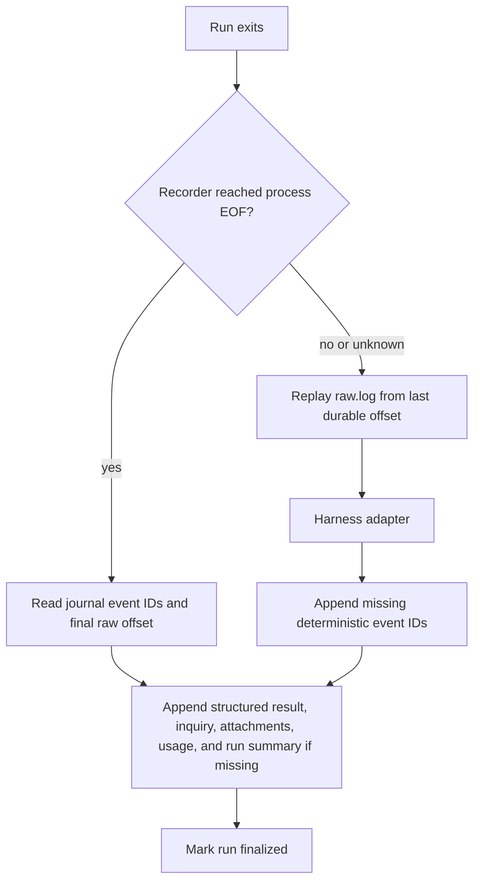

# Incremental Agent Messages and a Shared Durable Event Sequence

Date: 2026-08-16

Status: implemented on `agent/incremental-agent-event-journal`, backed by real Claude Code 2.1.220 and OpenCode 1.18.4 verification.

## Outcome

Tycho should normalize completed harness events while the harness is running and append them to one agent-scoped durable journal. Every writer—harness output, user messages, delegation lifecycle events, callbacks, and finalization—must use the same journal module. The journal assigns an agent-wide monotonic `sequence` under one lock and deduplicates deterministic `event_id` values.

This changes live conversation rendering from a merge of two independently ordered sources into a projection of one ordered source. `raw.log` remains the unchanged diagnostic firehose. `memory.jsonl` becomes the ordered semantic journal instead of an end-of-run transcript.

“Incremental” means one durable event per complete assistant message or content block. It does not mean token-by-token persistence unless a harness exposes token deltas and Tycho explicitly enables and assembles them.

## The Current Failure

The current path gives `memory.jsonl` and `raw.log` different persistence rules:



`AgentChatLog#chat_blocks` returns `memory_chat_blocks + live_run_chat_blocks`; it does not produce one cross-source order. A delegation event written to memory therefore appears before every current-run assistant block, even when the harness emitted the assistant message first.

Finalization makes the effect permanent. `capture_run_memory!` reparses the run and appends all assistant messages at that moment. Harness events do not carry a Tycho timestamp, so the parsers currently use `Time.now`. Every reparsed message can receive the same finalization timestamp.

The reported run contained this durable order:

```text
08:15:06  delegation_event   Started agent publish-fuller-screenshots
08:22:49  delegation report  Child run completed
08:23:18  assistant_message  stream sequence 17: I’ll use Tycho managed agents...
08:23:18  assistant_message  stream sequence 36: Both repositories are clean...
08:23:18  assistant_message  stream sequence 43: The capture agent confirmed...
... nine more assistant messages with the same timestamp ...
```

Twelve assistant messages with stream sequences `17..208` were persisted together at `08:23:18`. The first of those messages existed in `raw.log` before the command that created the later delegation.



Browser polling can add a small delay, but it does not cause this order. The backend supplies the blocks in that order.

## Real Harness Tests

The probes ran each installed harness directly in a temporary directory. A Ruby wrapper timestamped each complete stdout line using a monotonic clock. The prompts prohibited file edits, required a progress message, ran `printf` through the harness shell tool, and then required a final result.

Direct harness execution isolates the wire format from Tycho’s parser and persistence. It answers when each harness actually makes an event observable.

### Summary

| Harness | Version tested | Assistant stream unit | Tool stream unit | Token deltas in Tycho’s current command | Important ordering fact |
| --- | --- | --- | --- | --- | --- |
| Codex | Existing captured managed run | `item.completed` / `agent_message` | started/completed items | No | Each assistant message is observable only when that message item completes |
| Claude Code | 2.1.220 | complete `assistant` content block | `assistant.tool_use`, then `user.tool_result` | No; available behind `--include-partial-messages` | Progress text, tool call, tool result, and structured output arrived as separate records |
| OpenCode | 1.18.4 | complete `type=text` part | completed `type=tool_use` part | No supported delta flag in `opencode run --format json` | The completed tool record arrived just before the progress text that logically introduced it |

### Claude Code 2.1.220

The probe used Tycho’s current headless format:

```text
claude --print --output-format stream-json --verbose \
  --dangerously-skip-permissions \
  --json-schema '<Tycho agent-result schema>' \
  '<probe prompt>'
```

Observed sequence:



Representative output, reduced to fields relevant to persistence:

```json
{"elapsed_s":6.853,"type":"assistant","content":[{"type":"text","text":"CLAUDE_PROGRESS_ONE"}]}
{"elapsed_s":7.744,"type":"assistant","content":[{"type":"tool_use","name":"Bash","input":{"command":"printf CLAUDE_TOOL_OUTPUT"}}]}
{"elapsed_s":9.472,"type":"user","content":[{"type":"tool_result","content":"CLAUDE_TOOL_OUTPUT","is_error":false}]}
{"elapsed_s":11.934,"type":"assistant","content":[{"type":"tool_use","name":"StructuredOutput","input":{"status":"success","summary":"CLAUDE_FINAL","inquiry":null,"attachments":null}}]}
{"elapsed_s":11.960,"type":"result","subtype":"success","structured_output":{"status":"success","summary":"CLAUDE_FINAL","inquiry":null,"attachments":null}}
```

Claude therefore supports message-level incremental persistence with Tycho’s current flags. Tycho can append `CLAUDE_PROGRESS_ONE` as soon as the first `assistant` line arrives; it does not need to wait for the tool or final result.

Claude also advertises `--include-partial-messages`. A separate real probe emitted two `stream_event/content_block_delta/text_delta` records before the cumulative assistant record:

```json
{"type":"stream_event","event_type":"content_block_delta","delta_type":"text_delta","text":"CLAUDE_PARTIAL_STREAM_ABCDEFGHIJ"}
{"type":"stream_event","event_type":"content_block_delta","delta_type":"text_delta","text":"KLMNOPQRSTUVWXYZ_0123456789"}
{"type":"assistant","text":"CLAUDE_PARTIAL_STREAM_ABCDEFGHIJKLMNOPQRSTUVWXYZ_0123456789"}
```

Tycho should not enable partial messages for the first implementation. Persisting every token fragment would create excessive journal traffic, while persisting both deltas and the cumulative assistant record would duplicate text. If token-level rendering is added later, the Claude adapter should assemble deltas in memory and commit one durable message when the content block stops.

### OpenCode 1.18.4

The probe used Tycho’s current headless format:

```text
opencode run --format json --dir '<temporary workspace>' '<probe prompt>'
```

Observed sequence:



Representative output:

```json
{"elapsed_s":3.566,"type":"step_start","part":{"type":"step-start"}}
{"elapsed_s":3.820,"type":"tool_use","part":{"type":"tool","tool":"bash","state":{"status":"completed","input":{"command":"printf OPENCODE_TOOL_OUTPUT"},"output":"OPENCODE_TOOL_OUTPUT"}}}
{"elapsed_s":3.873,"type":"text","part":{"type":"text","text":"OPENCODE_PROGRESS_ONE"}}
{"elapsed_s":3.873,"type":"step_finish","part":{"type":"step-finish","reason":"tool-calls"}}
{"elapsed_s":5.090,"type":"text","part":{"type":"text","text":"{\"status\":\"success\",\"summary\":\"OPENCODE_FINAL\",\"inquiry\":null,\"attachments\":null}"}}
{"elapsed_s":5.090,"type":"step_finish","part":{"type":"step-finish","reason":"stop"}}
```

OpenCode emits complete text parts rather than token deltas. Its completed tool event contains the input, output, exit metadata, and timestamps in one record. In this run, that record reached stdout 53 ms before the requested progress text. Tycho must preserve OpenCode’s emitted order. It cannot infer a different order from the prompt or move prose ahead of a tool after the fact.

The existing `HQ::Parser::OpenCode` already accepts these `text`, `tool_use`, and `step_finish` shapes. A stream recorder can reuse that normalization logic after it is split into a line-oriented adapter.

OpenCode 1.18.4 also exposed a command-compatibility issue during verification. Its current `opencode run --help` advertises `--auto` for automatic permission approval and no longer advertises `--dangerously-skip-permissions`. This branch updates both headless and interactive OpenCode full-access commands to `--auto` and pins the removal with command-builder coverage.

### Codex

The reported managed run provides the relevant real capture. Codex emitted each progress update as a completed item:

```json
{"type":"item.completed","item":{"id":"item_0","type":"agent_message","text":"I’ll use Tycho managed agents for the capture..."}}
```

Codex does not expose a token delta in Tycho’s current `codex exec --json` path. The durable unit should be the completed `agent_message`. Command and tool items can still be recorded as separate semantic events when they start or complete.

## Implemented Architecture

The clean seam is an `AgentEventJournal` module. Callers should not allocate sequence numbers, open files, acquire locks, or implement deduplication themselves.



The module’s public interface can remain small:

```ruby
stored_event = journal.append(
  event_id: "run-42:claude:17:assistant-text",
  run_id: "run-42",
  type: "assistant_message",
  content: "Checking the repositories now.",
  occurred_at: Time.now,
  source: {
    "kind" => "claude_stream",
    "sequence" => 17,
    "raw_offset" => 84_221
  },
  metadata: {}
)
```

Its interface guarantees:

1. `sequence` is a positive integer, monotonic and unique within one managed agent.
2. An `event_id` is stored at most once. Repeating `append` returns the existing event.
3. Sequence allocation and append happen while holding one exclusive agent-journal lock.
4. A successful return means the complete JSON line has been flushed durably.
5. Callers may supply source-local order, but never the durable sequence.
6. Journal order is observation order. Tycho does not reorder events by timestamps.

The implementation can remain JSONL initially. Under the lock it reads the last valid record to allocate `sequence + 1`, checks deterministic IDs when reconciliation can repeat an event, appends one complete line, flushes, and `fsync`s. Normal event capture must stop rewriting the whole file. Maintenance rewrites must use the same lock and atomic replacement protocol.

If full-file event-ID checks become expensive, optimize inside the module after measuring. Do not expose a second storage interface or sidecar protocol to callers. The interface can hide a later SQLite implementation without changing stream adapters or renderers.

## Durable Event Shape

Every semantic record should use the same envelope:

```json
{
  "schema_version": 1,
  "sequence": 704,
  "event_id": "run-42:claude:17:assistant-text",
  "run_id": "run-42",
  "type": "assistant_message",
  "content": "Checking the repositories now.",
  "occurred_at": "2026-08-16T08:15:01.421+07:00",
  "recorded_at": "2026-08-16T08:15:01.426+07:00",
  "source": {
    "kind": "claude_stream",
    "sequence": 17,
    "raw_offset": 84221
  },
  "metadata": {}
}
```

Field meanings:

| Field | Meaning |
| --- | --- |
| `sequence` | The only authoritative cross-source conversation order |
| `event_id` | Deterministic identity used for crash recovery and finalization deduplication |
| `run_id` | The Tycho run that caused the event; absent only for agent-level events that truly have no run |
| `occurred_at` | Best available event time for display; the recorder’s observation time when the harness provides none |
| `recorded_at` | Time the journal committed the event |
| `source.kind` | `codex_stream`, `claude_stream`, `opencode_stream`, `user`, `delegation`, or `finalizer` |
| `source.sequence` | Harness-local line/event order; diagnostic, not a cross-source sort key |
| `source.raw_offset` | Recovery cursor into `raw.log` when the source is a harness stream |

Use timestamps for labels and latency measurements, not ordering. Wall clocks can collide or move backward; parser-time timestamps caused the current batch-order defect.

### Example: Correct Cross-Source Order

```jsonl
{"schema_version":1,"sequence":704,"event_id":"run-42:codex:17:assistant","run_id":"run-42","type":"assistant_message","content":"I’ll inspect both repositories first.","occurred_at":"2026-08-16T08:15:01.421+07:00","recorded_at":"2026-08-16T08:15:01.426+07:00","source":{"kind":"codex_stream","sequence":17,"raw_offset":84221}}
{"schema_version":1,"sequence":705,"event_id":"delegation-created:abc123","run_id":"run-42","type":"delegation_event","content":"Started agent publish-fuller-screenshots","occurred_at":"2026-08-16T08:15:06.002+07:00","recorded_at":"2026-08-16T08:15:06.006+07:00","source":{"kind":"delegation"},"metadata":{"event":"agent_started"}}
{"schema_version":1,"sequence":706,"event_id":"run-42:codex:36:assistant","run_id":"run-42","type":"assistant_message","content":"Both repositories are clean and available.","occurred_at":"2026-08-16T08:15:08.114+07:00","recorded_at":"2026-08-16T08:15:08.118+07:00","source":{"kind":"codex_stream","sequence":36,"raw_offset":90117}}
```

The projected UI becomes:

```text
ASSISTANT  8:15:01
I’ll inspect both repositories first.

TYCHO  8:15:06
Started agent publish-fuller-screenshots

ASSISTANT  8:15:08
Both repositories are clean and available.
```

## Stream Recorder and Harness Adapters

The current detached runner sends child stdout and stderr directly to `raw.log`, so Tycho cannot persist semantic events at the moment they arrive. Replace that redirect with a checked-in recorder process or module:



Each harness adapter owns only wire-format knowledge:

| Adapter | Commit rule |
| --- | --- |
| Codex | Commit `item.completed/agent_message`; normalize completed command/file/tool items separately |
| Claude | Commit complete `assistant` text blocks, tool-use blocks, tool results, and result/usage; ignore thinking; do not enable partial messages initially |
| OpenCode | Commit `type=text`, completed `type=tool_use`, and `step_finish` usage; preserve emitted order |

The recorder must buffer until newline so a partially written JSON object is never parsed or journaled. It must still copy non-JSON lines to `raw.log`; adapters may ignore them or normalize known warnings.

## Finalization and Recovery

Finalization becomes reconciliation, not the primary projection path:



Recovery rules:

1. Give every normalized stream event a deterministic ID derived from `run_id`, harness, source sequence, and semantic subtype.
2. Persist the raw byte offset on stream-derived events.
3. On restart or finalization, replay from the last durable offset and call the same adapter and journal interface.
4. Let journal deduplication make replay safe.
5. Append a run summary after all reconciled stream events, so the summary receives the last durable sequence for that run.
6. Never assign historical events a finalization timestamp when their observation time is available.

## Conversation Reads

For sequenced runs, `AgentChatLog#chat_blocks` projects journal events in `sequence` order and suppresses the separately parsed live tail. The live parser remains only as a compatibility fallback for a running legacy process without a projected current-run event.

A transition release can still read legacy events without `sequence`:

1. Keep existing file order for legacy records.
2. Assign an in-memory legacy ordinal when reading them.
3. Place sequenced records after the legacy prefix.
4. Deduplicate current-run records by `event_id` if live-tail fallback remains temporarily enabled.
5. Remove live-tail merging after the recorder has proven reliable across Codex, Claude, and OpenCode.

Do not sort mixed events by `created_at`. Timestamp sorting recreates the same ambiguity with a different field name.

## Implementation Slices

1. Add `AgentEventJournal` with locked sequence allocation, deterministic-ID deduplication, append durability, and interface-level tests.
2. Extract line-oriented Codex, Claude, and OpenCode adapters from the existing whole-stream parsers. Keep whole-stream parsing as an adapter-driven replay operation.
3. Replace direct process redirection with `StreamRecorder`, retaining byte-for-byte `raw.log` output.
4. Make finalization reconcile missing stream events and append only final semantic records.
5. Project conversation blocks exclusively from journal sequence.
6. Add crash/restart, duplicate replay, concurrent delegation, and multi-harness regression tests.
7. Update the current hybrid-rendering decision in `docs/PROJECT_STATUS.md` only when the implementation ships.

## Required Regression Scenarios

| Scenario | Expected result |
| --- | --- |
| Assistant message, then child delegation | Assistant has the lower durable sequence and renders first |
| Delegation callback during a running parent | Callback receives one sequence among already persisted stream messages; no batch jump at finalization |
| Recorder crashes after raw write but before journal append | Replay from raw offset appends the missing event exactly once |
| Journal append succeeds but finalizer replays the line | Deterministic `event_id` returns the existing event |
| Claude text, tool use, tool result, structured result | Four ordered semantic records appear before run summary |
| Claude partial-message mode accidentally enabled | Adapter does not duplicate delta text and cumulative assistant text |
| OpenCode tool record before progress text | UI preserves the observed tool-then-text order |
| Two processes append delegation and stream events concurrently | Sequences remain unique and strictly increasing |
| Legacy memory without sequence | Existing conversation order remains stable during migration |

## Decision Boundaries

- Keep `raw.log`. It is the lossless harness artifact and recovery source.
- Keep the initial journal format as JSONL unless measured write or deduplication cost justifies another implementation.
- Do not expose journal storage adapters before a second implementation exists.
- Do not persist token fragments in the first release.
- Do not infer “logical” order across harness events. Persist observation order through one journal.
- Keep `docs/PROJECT_STATUS.md` aligned with the sequenced journal path now that it replaces hybrid rendering for new runs.

## Post-implementation Real Harness Verification

The implemented `AgentStreamRecorder` was run against both installed harnesses
in fresh temporary directories. In both cases the first assistant message was
visible in `memory.jsonl` while the harness thread was still alive.

Claude Code 2.1.220 produced this durable order:

```text
1 assistant_message  CLAUDE_JOURNAL_PROGRESS
2 tool_summary       Bash: Print journal verification marker
3 tool_summary       tool result: CLAUDE_JOURNAL_TOOL
4 tool_summary       StructuredOutput: success — CLAUDE_JOURNAL_FINAL
5 tool_summary       tool result: Structured output provided successfully
6 token_usage        $0.3445, 264 output tokens, 3 turns, 8278ms
```

OpenCode 1.18.4 preserved its native tool-before-progress order:

```text
1 tool_summary       bash: printf OPENCODE_JOURNAL_TOOL
2 tool_summary       tool result: OPENCODE_JOURNAL_TOOL
3 assistant_message  OPENCODE_JOURNAL_PROGRESS
4 token_usage        first step usage
5 assistant_message  OPENCODE_JOURNAL_FINAL
6 token_usage        final step usage
```

Both harnesses exited successfully. The repository regression suite also
passes with incremental persistence, finalization replay deduplication,
concurrent journal writers, legacy-prefix migration, and conversation-order
coverage.
